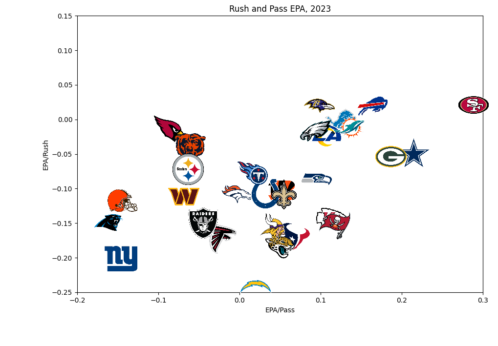
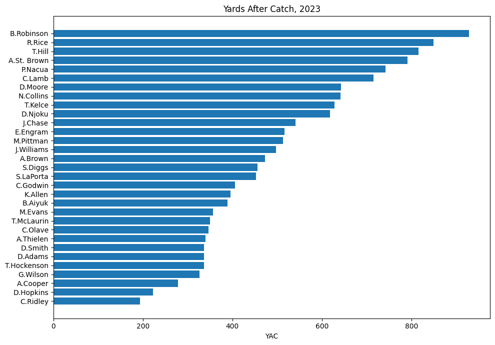

# NFL Data Visualizations with Team Logos using Python on Google Colab

This repository contains Python code for creating NFL data visualizations with team logos using Google Colab. The visualizations focus on two key metrics: "Rush and Pass EPA" and "Yards After Catch."

## Overview

The code utilizes NFL data to generate insightful visualizations, providing a deeper understanding of team & player performance in terms of offensive efficiency and yards gained after the catch. By incorporating team logos into the graphs, the visualizations become more engaging and user-friendly.

## Getting Started

To run the code and generate the visualizations, follow these steps:

1. Clone this repository:

   ```bash
   git clone https://github.com/smazurs/NFL-Data-2023
   ```

2. Open the `NFL_Data_2023.ipynb` notebook in Google Colab.

3. Execute the code cells in the notebook to generate the visualizations.

## Example Visualizations


*Figure 1: Rush and Pass EPA Visualization*


*Figure 2: Yards After Catch Visualization*

## Contributing

Contributions are welcome! If you have suggestions, improvements, or additional features you'd like to see, feel free to open an issue or submit a pull request.

## License

This project is licensed under the MIT License - see the [LICENSE](LICENSE) file for details.
